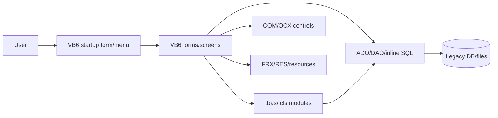
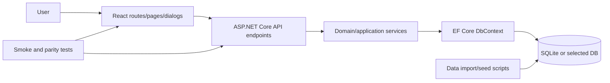

# Pre-Migration Design Brief

Create `docs/migration-governance-brief.md` in the target migration repo after inventorying the whole VB6 source project and before broad coding, unless the user has already approved an equivalent plan. It must be written for human review, not just for agent execution. The goal is to make the migration auditable, governed, reliable, and repeatable.

Also create or update `docs/source-application-brief.md` in the target repo. The inventory helper writes a first draft; correct it manually when the source contains dynamic behavior the helper cannot infer.

Keep the VB6 source repo and generated target repo separate by default. The source repo is evidence and input; the target repo is where docs, implementation, tests, ledgers, and scripts are written.

## Review Gate

Before implementation begins, follow the gate sequence in `migration-decision-workflow.md`. At minimum, show the user:

- `docs/source-application-brief.md`
- `docs/migration-options.md`
- `docs/migration-governance-brief.md`
- `docs/test-plan.md`

Also show the absolute source repo path and target repo path.

Then ask explicitly:

> I have prepared the source application brief, migration options, governance brief, and test plan in the proposed target repo. Have you reviewed them, what questions or corrections do you have, and do you approve proceeding to implementation planning?

Do not start Phase 1 implementation until the user confirms. If the user has not read them, summarize the key decisions in-chat or open the files for them. Record the approval in `docs/migration-notes.md` or the governance brief with date, approver, target repo, and scope.

## Required Sections

1. Source summary
   - Startup object and first screen.
   - Forms, modules, classes, resources, data files, project groups, and COM/OCX references.
   - Major user roles and public/private workflows.
   - Old-system diagram in Mermaid showing user entry points, forms/menus, modules/classes, data access, databases/files, COM/OCX controls, and resources.

2. Target experience
   - What the user sees first in the web app.
   - Route/screen list.
   - Which VB6 forms become pages, tabs, panels, dialogs, prompts, or background services.
   - Which workflows intentionally change for web ergonomics.
   - New-system diagram in Mermaid showing React routes/components, API endpoints, services, EF Core entities, database, import scripts, auth, and packaging/deployment lane when selected.

3. Migration choices
   - Selected backend, frontend, database, data strategy, auth, UI strategy, hosting, packaging, backend tests, frontend tests, parity tracking, and build gate.
   - Rationale, rejected alternatives, risks, and output impact.
   - Link to `docs/migration-options.md` and decision-log rows.

4. Architecture
   - Target repo path, .NET projects, React project, database target, and runtime assumptions.
   - API endpoints grouped by workflow.
   - Domain/application services and where business rules live.
   - Source-to-target architecture mapping table:

     | Legacy layer/item | Target layer/item | Rationale | Verification |
     |---|---|---|---|

5. Data plan
   - Schema mapping from Access/DAO/ADO/SQL Server to EF Core.
   - Seed data.
   - Import/export plan for existing `.mdb`, `.accdb`, or `.bak` data, or why import is not applicable.
   - Database mapping table:

     | Source table/query/file | Source columns/meaning | Target entity/table | Transform/import rule | Verification |
     |---|---|---|---|---|

6. Semantic hazard plan
   - `On Error`, `Resume Next`, default properties, `Collection`, arrays/bounds, date/currency/null handling, global state, and UI index lookups.
   - Specific tests or characterization checks for risky behavior.

7. Test and evidence plan
   - Backend test approach.
   - Frontend test approach.
   - Smoke-test coverage.
   - Data import/seed validation.
   - Semantic hazard tests.
   - Commands to record in `docs/test-results.md`.

8. Slice plan
   - Ordered workflow slices from smallest runnable slice to full parity.
   - For each slice: source files/procedures, target components, tests, and smoke checks.
   - For each slice: ledgers and slice report updates required before moving on.

9. Governance controls
   - Required review gates: source brief approval, governance brief approval, slice completion, parity audit, accepted deferrals.
   - Evidence artifacts: inventory JSON/MD, source brief, governance brief, ledgers, smoke logs, build/test results, parity audit report.
   - Change-control rule: every unmigrated, redesigned, or deferred legacy behavior needs an explicit ledger row.
   - Repeatability rule: commands/scripts used for inventory, build, data import, smoke testing, and packaging must be recorded in docs or scripts.
   - User-steering rule: user changes are change requests; update impacted docs/tests/ledgers and ask for renewed approval when scope, stack, tests, packaging, parity, or build output changes.

10. Completion criteria
   - All forms/procedures mapped to migrated, intentionally redesigned, user-deferred, blocked, or not applicable.
   - Backend build/test pass.
   - Frontend lint/build pass.
   - Live smoke checks pass in the target runtime.
   - `vb6-parity-auditor` has run and every blocking finding is fixed, user-deferred, blocked with a concrete reason, or not applicable.
   - Compatibility, semantic, and remaining-work ledgers are current.
   - Final product build has explicit user approval.
   - Final build report and migration closeout are complete.
   - User has accepted the final handoff packet.

## User Review

Show the design brief before implementation. Ask the user to confirm notable product choices, especially:

- Whether public workflows remain public.
- Whether login, confirmation, and helper forms should remain modal.
- Whether the target should preserve exact UI layout or use web-native task layouts.
- Whether plaintext password parity should be kept only for demo migration or replaced immediately.
- Whether SQLite is sufficient or a server database is preferred.

## Diagram Templates

Old system:

New system:

Use these as starting points. Replace generic node names with project-specific screens, modules, services, and data stores.
